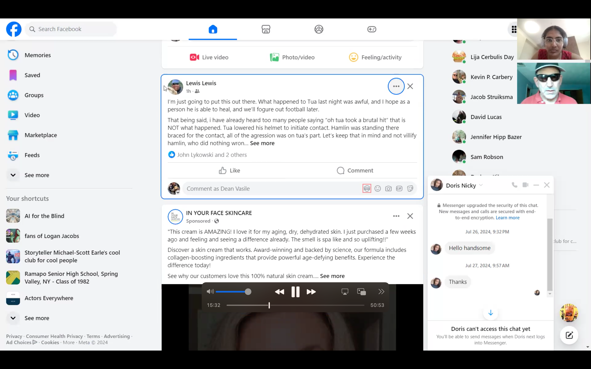
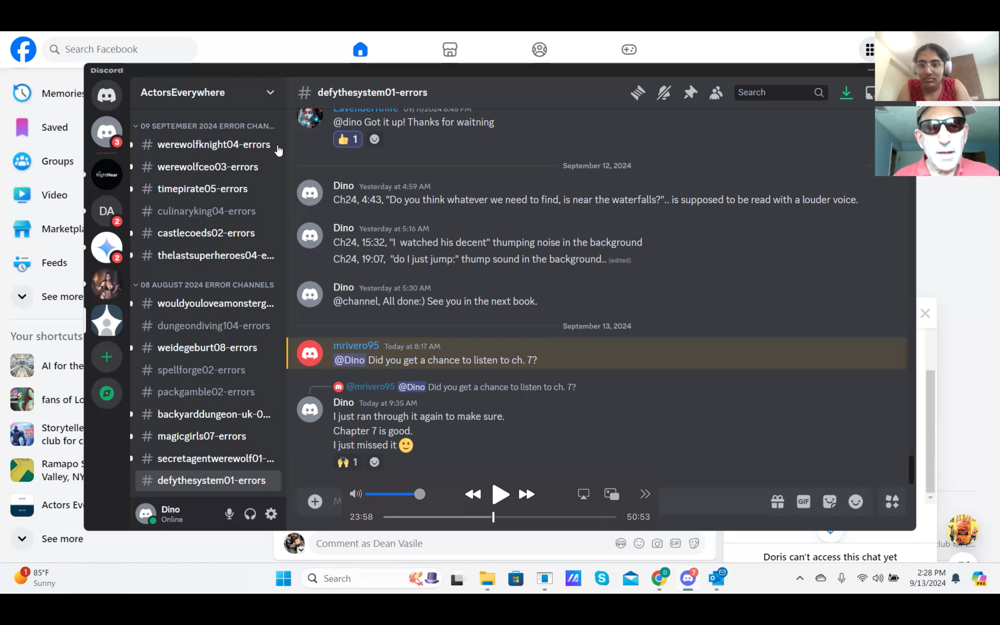
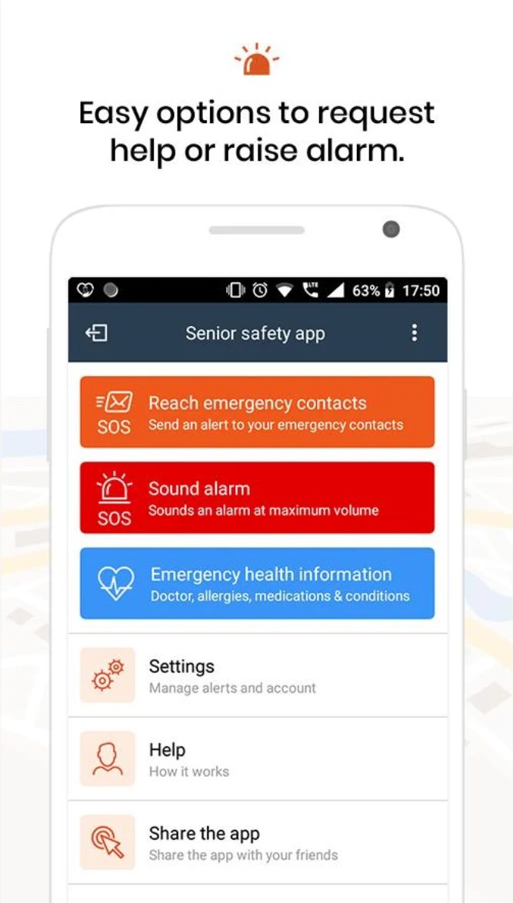
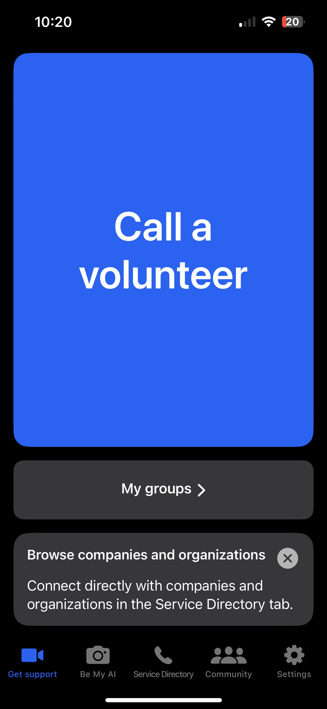
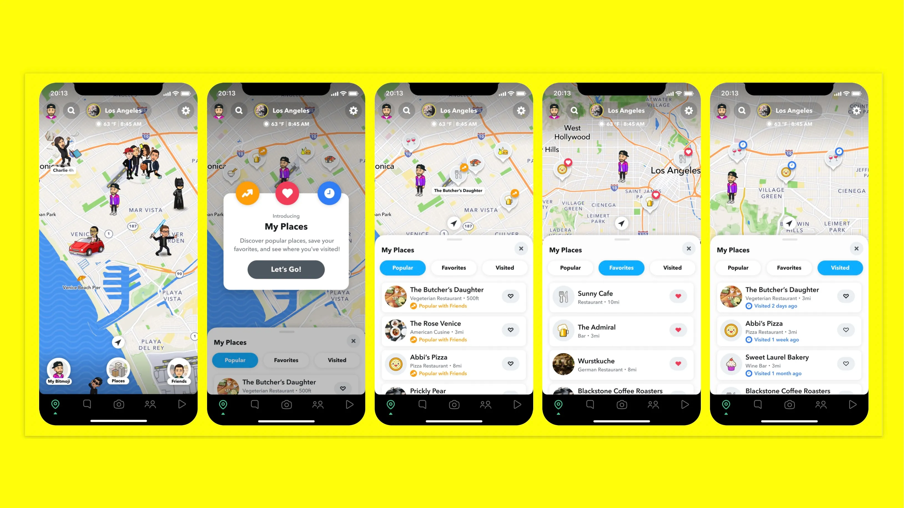
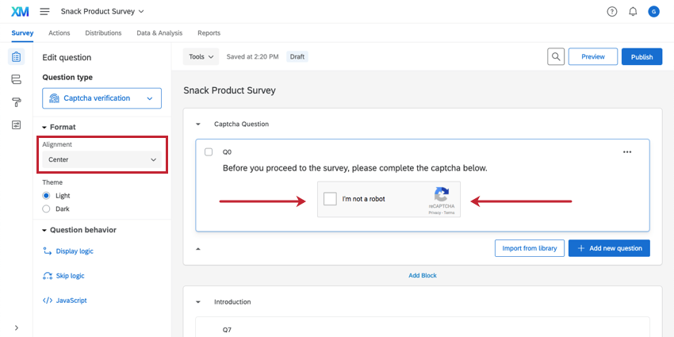
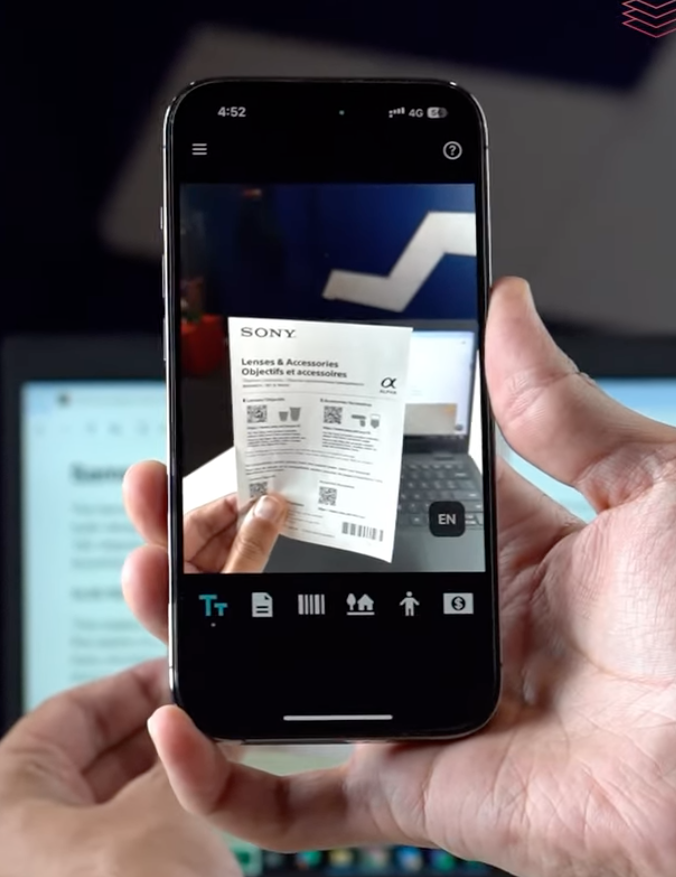
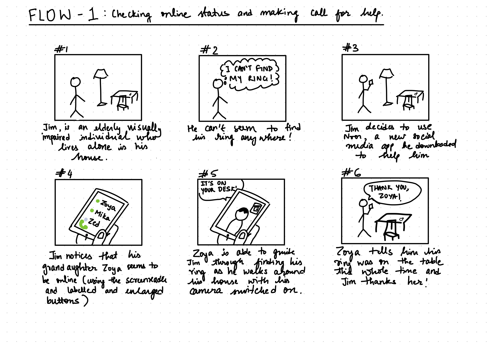
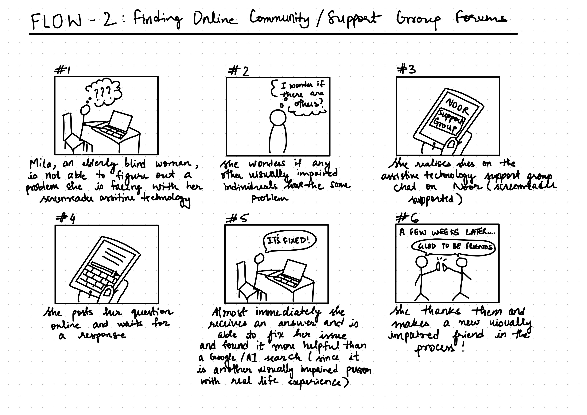
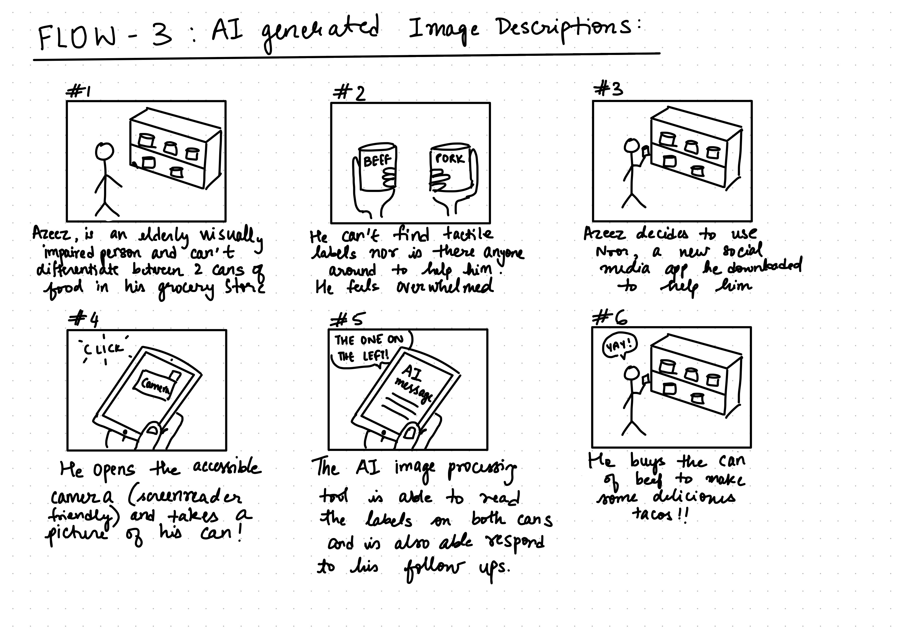

# Assignment 2: Divergent Design
 
 

**1. Broad application goals.**
- App name: Noor - it means “light” in Arabic, symbolizing the idea of shining a light on and illuminating the digital world for visually impaired users.
- Description of intended audience: The app is designed specifically for people with visual impairments, focusing on elderly individuals in this community.
- Value beyond other apps: After conducting interviews with Dino and Sheri, two elderly blind participants, it became clear that mainstream apps like Facebook claim to be accessible, but they fall short in practice. Noor will fill this gap by providing an app for the visually impaired, focusing on features like streamlined screen reader navigation, accurate AI image descriptions, voice command functionality, and other accessibility features that cater to the needs of elderly users as well. Noor wants to offer a more intuitive, enjoyable, and representative way for our users to connect with family and friends.
    
    *Figure 1: Dino (he/him) walking me through all the unlabeled buttons and non-streamlined screen reader navigation tools on Facebook.*
     
      
     *Figure 2: Dino walking me through Discord with his screenreader where he talks about his issues with CAPTCHA security verification being inaccessible to visually impaired users (not pictured) on Discord.*
 
 

**2. Scrapbook of comparables.**
 

*Figure 3: Example of a Senior Safety App. This app showcases an interface designed specifically for elderly users, emphasizing safety features like emergency contacts and quick access buttons. It inspires Noor to prioritize intuitive design for easy navigation, ensuring that vital information is always accessible in case of emergencies.*

*Figure 4: Be My Eyes connects visually impaired individuals with volunteers for real-time assistance. The simplicity of its interface and the immediacy of support highlights the value of community engagement. Noor can draw from this by integrating similar support but with their friends and famil*

*Figure 5: Example of Snapchat location sharing, showcasing how, after giving permissions, locations can be shared with close friends and family. Could Noor adopt a similar feature, enabling elderly users to share their locations with trusted contacts in case of emergencies, ensuring safety while maintaining user control?*

*Figure 6: Example of Qualtrics (survey app that a lot of visually impaired users also use) having accessible CAPTCHA security. Can Noor implement something similar for easy use of the app while also maintaining security??*

*Figure 7: Example of Seeing AI, which provides audio descriptions of the environment. Noor could have a feature that allows users to request audio summaries of social media posts or real-life interactions. This feature could also help users feel more connected to their friends and family, ensuring they don’t miss important conversations or shared moments*

[Watch Video on YouTube ](https://youtube.com/shorts/H0lp93rspf0) 
*Video 1: Example of Be My Eyes accessible resource collection. The simplicity of its features also helps elderly individuals. How can Noor implement a collection of resources for people with visual impairments*
 
 

**3. Brainstorming feature ideas.**
- List of 21 Features:
    - Alt text on audio descriptions on photos and videos- All images uploaded on the platform would come with AI-generated audio descriptions that provide detailed context about the contents of the image, including objects, scenery, and any people present.
    - Feed filters- be able to change to only see friends and family - Users can customize their feed to prioritize posts from specific people (like close family or friends) or filter out less relevant content, ensuring they stay connected with the most important updates.
    - Assistance/ Online status feature: Check to see when someone is online so that you can get quicker responses in cases of emergencies (amongst the elderly)  
    - Emergency Alerts - In case of an emergency (since the users might be elderly and visually impaired), a signal can be sent to close family members and friends to help them in need.
    - Keep the app simple to not overwhelm elderly individuals - The interface design is streamlined with larger buttons, fewer steps to complete actions, and a clutter-free layout to reduce overwhelm for elderly users.
    - Accessible messaging- The messaging feature will be fully compatible with screen readers, allowing users to easily chat with friends and family.
    - AI image descriptions: Every image in the social feed is accompanied by an automatically generated, detailed description using AI. These descriptions provide context about the scene, objects, and emotions present in the image.
    - Family and Friends Location Sharing: A "consent-given" feature allowing users to share their real-time location with trusted contacts. This can help in cases where users are lost or need guidance to a specific place.
    - Accessible CAPTCHA and security login - Dino was talking about how he can’t use apps like Discord and Amazon due to inaccessible CAPTCHA so a haptic or voice-modulated CAPTCHA security protocol can occur.
    - Audio-based notifications Notifications for messages, likes, and comments are read aloud to users through the app, allowing them to stay updated without relying on visual cues.
    - Birthday notification feature - Users receive personalized audio reminders for friends' birthdays, events, or important dates, helping them stay socially connected and engaged. A feature one of my interviewees appreciated!
    - Having support groups with other visually impaired people -The app provides virtual support groups where visually impaired users can connect, share experiences, and discuss challenges with others in similar situations.
    - Have a list of resources that the visually impaired can use. - Noor will offer a collection of resources like articles, guides, and videos about navigating the digital world as a visually impaired person.
    - Voice command navigation 
    - Labeled buttons- Make sure all buttons and navigation tabs are labeled for a better screen reader experience
    - Accessible game plays for entertainment purposes- The app includes a range of simple, accessible games (like audio-based puzzles or memory games) designed to entertain and stimulate users. A feature Sheri, one of my interviewees would love to see.
    - Text Enlargement and High Contrast Mode: users with low vision or light sensitivity can adjust the text size and enable a high contrast mode for better readability.
    - Family and Friends Location Sharing: A voluntary feature allowing users to share their real-time location with trusted contacts. This can help in cases where users are lost or need guidance to a specific place.
    - Onboarding for New Users- guide: A step-by-step, audio-guided onboarding process to help new users (especially the elderly) learn how to use the app, for the users to understand its features without being frustrated.
    - Daily/ Weekly Check-In: feature where users can confirm they are doing okay by tapping a button or using voice commands. This can automatically notify close family or friends (who are given permission to access this info), providing peace of mind without requiring constant communication.
    - Summarized Long texts: Using a screenreader to read through lengthy posts can be very time consuming and frustrating. An AI summarization tool could help this process.
 
 

**4. VSD analysis.**
- List of 6 VSD analysis
    1. Stakeholders: Direct and Indirect Users
        - Observation: Direct stakeholders are elderly, visually impaired individuals who will interact with Noor for social engagement. Indirect stakeholders include family members, caregivers, and emergency responders. Caregivers may need access to some user data to provide proper assistance, raising privacy concerns.
        - Design Response: Creating a permission-based privacy information sharing system where visually impaired users can choose to share information like location, health status, and emergency contacts.
    2. Stakeholders: Variation in Abilities
        - Observation: Noor target audience is elderly individuals with visual impairments, but users may also face other physical challenges like limited hearing or motor skills and have intersectional disabilities. This could affect how they interact with the app.
        - Design Response: Implementing a multimodal accessibility feature, such as offering speech alternatives like touch-based navigation with larger buttons. This would ensure that users with multiple disabilities can still use Noor.
    3. Values: Value Tensions 
        - Observation: A big value tension Noor might face is between privacy and caregiver oversight. Elderly users may want to maintain their independence and privacy, but caregivers may want insight into the user for safety reasons.
        - Design Response: Offer different access levels to each person, where users can assign emergency-only access to caregivers or set certain data-sharing permissions. This balances privacy with safety.
    4. Time: Long-Term Health and Well-Being 
        - Observation: Regular use of Noor could either improve or degrade long-term mental health and well-being. While it could reduce loneliness through digital interaction, over-reliance on the app for social connections may reduce physical activity and face-to-face interactions.
        - Design Response: Introducing a "well-being" tracker to promote physical and social activity. This will encourage users to engage with the world outside of their phones and plan physical meet-ups with friends and family.
    5. Time: Changing Hands
        - Observation: When an elderly user passes away or transitions to a different caregiver, it can lead to challenges in transferring data and ownership, affecting ongoing communication and support.
        - Design Response: Introduce a data transfer protocol that allows designated family members or caregivers to easily inherit the account with appropriate permissions. This could include options for legacy contacts to manage the user’s information and maintain continuity in communication.
    6. Pervasiveness: Widespread Use
        - Observation: While it could enhance community building among the visually impaired, large-scale adoption might also lead to information overload or the creation of subgroups that foster isolation or conflict.
        - Design Response: Having moderation tools and structured group discussion formats that prioritize inclusivity and constructive interaction. Noor could also provide users with tools to manage audio notifications and interactions to avoid information overload and frustrations.
 
 

**5. Storyboarding and sketching.**

*Figure 8: Flow 1: Checking online status and making call for help*
 
 

*Figure 9: Flow 2: Finding online community/ support group forums*
 
 

*Figure 10: Flow 3: AI-generated image descriptions*
 
 
 
In conclusion, Noor is designed to empower elderly visually impaired people by prioritizing accessibility, representation, connection, and safety. Noor aims to create an inclusive environment where users can engage with their loved ones and the wider community without barriers.
 
Noor, Let your light, light up the world!