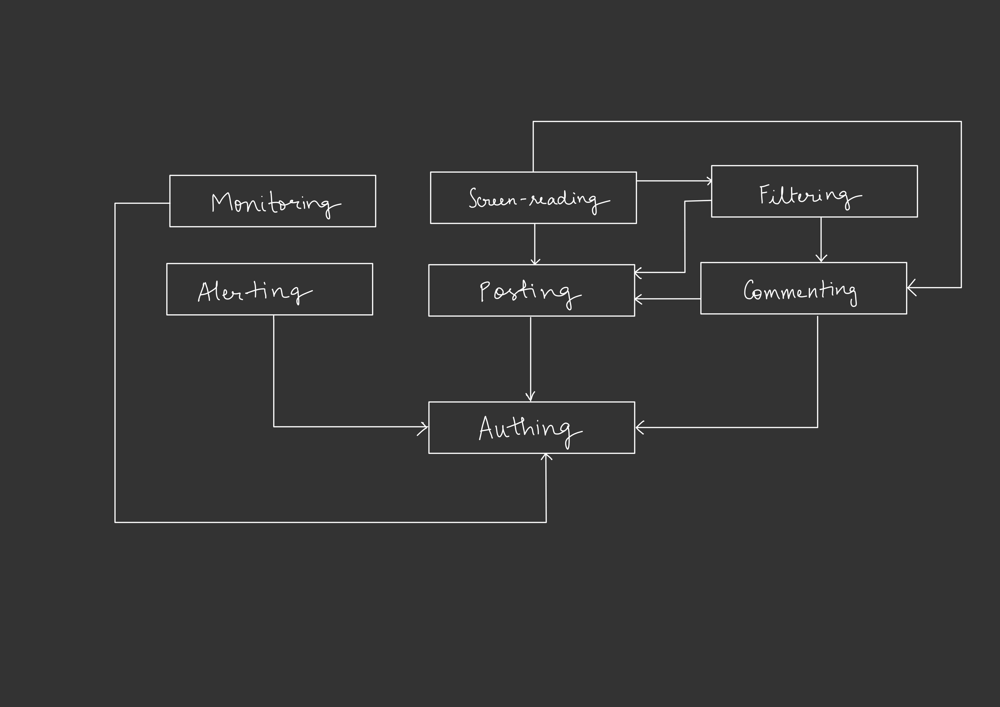

# Assignment 3- Convergent Design

## Pitch.

Noor, meaning “light” in Arabic, was made to shine a light on the social media world for elderly users with visual impairments. The purpose of Noor is to fill in the gaps created by mainstream social media apps like Facebook, Discord, and other social media apps, which struggle to make their features accessible to visually impaired users. Noor prevents frustrations of unlabelled buttons, inaccessible posts, and confusing layouts that these apps are known to possess. By offering emergency alerting, message filtering (to reduce exposure to biases and harmful stereotypes), and a simple screen-reader optimized navigation and user interface for streamlined screen reader usage, Noor allows users to engage with their friends and family without frustrations. We wish to promote independence while maintaining a sense of support at the same time with the help of location sharing and alerts during emergencies. By placing a focus on accessibility, safety, and social connection, Noor aims to offer support to a severely marginalized community in the social media space. Let Noor be the light that connects and supports visually impaired elders, without any barriers.

Noor, let your light, light up the world!
 

## Functional Design

### Concept 1: Authing
- Purpose: Authenticates users and ensures login.
- Operational Principle: After registering with a username, password, and accessible CAPTCHA, users can authenticate and access their accounts.
- State:
    - registered: set String
    - passwords: registered → one String
    - loggedIn: set String
    - captchas: set String
- Actions:
    - register (username: String, password: String, captcha: String)
        - username in registered - false
        - registered += username
        - passwords[username] := hash(password)
        - captchas += captcha
    - authenticate (username: String, password: String)
        - username in registered
        - passwords[username] == hash(password)
        - loggedIn += username
        - logout (username: String)
        - username in loggedIn
        - loggedIn -= username

### Concept 2: Posting
- Purpose: Enable users to post content (text, image, or video) for others to view.
- Operational Principle: Users create posts, which are made available in the feed (Posts are accessible via screen reader navigation)
- State:
    - posts: set Post
    - postAccessibility: posts → one AccessibilityData
- Actions:
    - createPost (content: String, media: Audio/Video, out post: Post)
        - post not in posts
        - posts += post
        - postAccessibility[post] := media.accessibilityData
    - deletePost (postId: String)
        - postId in posts
        - posts -= postId

### Concept 3: Commenting
- Purpose: Allow users to comment on posts or other items.
- Operational Principle: Comments can be added to any "item" (posts, messages). The Commenting concept is abstract and does not directly reference other concepts.
- State:
    - comments: set Comment
    - commentedOn: comments one-to-one Item
    - replies: comments one-to-many set Comment
- Actions:
    - commentOnItem (itemId: String, comment: String)
        - comment not in comments
        - comments += comment
        - commentedOn[comment] := itemId
    - replyToComment (commentId: String, reply: String)
        - reply not in replies[commentId]
        - replies[commentId] += reply
    - deleteComment (commentId: String)
        - commentId in comments
        - comments -= commentId

### Concept 4: Screen-reading
- Purpose: Makes sure to use voice navigation and ensure that the apps content is not only screen reader accessible but also  
- Operational Principle: Rather than implementing a separate reading mechanism, the app is structured with clear labels, logical flow, and summarized content to make it easier for screen readers to navigate and present information efficiently.
- State:
    - contentStructure: set Page
    - ariaRegions: contentStructure one-to-many set ARIA_Regions
    - summarizedContent: posts → one String
    - accessibleLabels: set Element  → one String
- Actions
    - labelElement (elementId: String, label: String)
        - elementId not in accessibleLabels
        - accessibleLabels[elementId] := label
    - generateSummary (postId: String, out summary: String)
        - postId in posts
        - summarizedContent[postId] := summary

### Concept 5: Filtering
- Purpose: Allow users to filter their feed to prioritize content from close friends or family to prevent biases/ harmful stereotypes against the disability community.
- Operational Principle: Users define rules that determine the visibility of posts and other content in their feed.
- State:
    - filterSettings: set User one-to-many set Rule
    - priorityGroups: set User
- Actions:
    - applyFilter (settings: Rule)
        - settings not in filterSettings
        - filterSettings += settings
    - addToPriorityGroup (userId: String)
        - userId in priorityGroups
        - priorityGroups += userId

### Concept 6: Alerting/Locating
- Purpose: Allow users to send emergency alerts along with location data to trusted contacts.
- Operational Principle: after a user faces an emergency, they can share their current location and provide an alert to their trusted contacts in case of emergencies.
- State:
    - location: set Coordinates
    - emergencyContacts: set User
    - alertStatus: set Boolean
- Actions:
    - activateEmergencyAlert (coordinates: Coordinates)
        - alertStatus := true
        - location := coordinates
    - deactivateEmergencyAlert ()
        - alertStatus := false
    - updateLocation (coordinates: Coordinates)
        - alertStatus == true
        - location := coordinates

### Concept 7: Monitoring
- Purpose: Ensure that caregivers or family members can periodically check in on the elderly user's well-being by receiving scheduled updates or prompts for user responses.
- Operational Principle: After setting up trusted contacts, the system monitors the user at regular intervals, prompting them to check in. 
- State:
    - userCheckInStatus: set Boolean
    - checkInSchedule: set DateTime
    - trustedContacts: set User
- Actions:
    - scheduleCheckIn (userId: String, schedule: DateTime)
        - schedule not in checkInSchedule
        - checkInSchedule[userId] := schedule
    - recordCheckIn (userId: String)
        - userId in checkInSchedule
        - userCheckInStatus[userId] := true
    - alertContacts (userId: String)
        - userCheckInStatus[userId] == false
        - notify trustedContacts[userId]

## Synchronizations of Concept Actions

### Subsets
\{Authing\}

\{Posting, Authing\}

\{Commenting, Posting, Authing\}

\{Filtering, Posting, Authing\}

\{Filtering, Commenting, Posting, Authing\}

\{Screenreading, Posting, Authing\}

\{Screenreading, Commenting, Posting, Authing\}

\{Screenreading, Filtering, Posting, Authing\}

\{Screenreading, Filtering, Commenting, Posting, Authing\}

\{Monitoring, Authing\}

\{Alerting, Authing\}

\{Monitoring, Alerting, Authing\}

\{Monitoring, Posting, Authing\}

\{Alerting, Posting, Authing\}

\{Monitoring, Alerting, Posting, Authing\}

### App Level & Synchronizations
Include: Authing, Posting[Authing.User ], Commenting[Posting.Post ], Screenreading[Posting.Post, Commenting.Comment], Monitoring[Authing.User ], Filtering[Posting.Post, Commenting.Comment], Alerting[Monitoring.User ]

sync: register(username: String, password: String, out user: User)
    Authing.register(username, password, user)

sync: authenticate(username: String, password: String, out user: User)
    Authing.authenticate(username, password, user)

sync: post(user: User, p: Post)
    Authing.isAuthenticated(user)
    Posting.createPost(user, p)
    Screenreading.labelElement(p)

sync: commentOnPost(user: User, postId: Post, comment: Comment)
    Authing.isAuthenticated(user)
    Commenting.commentOnItem(postId, comment)
    Screenreading.labelElement(comment)

sync: applyFilter(user: User, settings: Rule)
    Authing.isAuthenticated(user)
    Filtering.applyFilter(settings)
    Posting.filterPosts(settings)

sync: activateEmergencyAlert(user: User, location: Coordinates)
    Authing.isAuthenticated(user)
    Monitoring.verifyCheckIn(user)
    Alerting.activateEmergencyAlert(location)

sync: checkIn(user: User)
    Authing.isAuthenticated(user)
    Monitoring.recordCheckIn(user)

sync: failToCheckIn(user: User, out alert: Boolean)
    Authing.isAuthenticated(user)
    Monitoring.checkFailure(user, alert)
    Alerting.activateEmergencyAlert(location)

sync: allowContent(user: User)
    Authing.isAuthenticated(user)
    Filtering.allowContent(user)

sync: denyContent(user: User)
    Authing.isAuthenticated(user)
    Filtering.denyContent(user)

sync: unregister(user: User)
    Authing.isAuthenticated(user)
    Authing.unregister(user)

## Dependency Diagram:

## Wireframes
Link to WireFrames: https://www.figma.com/design/WKxhMFRzPR1yDqL3s9WpRt/A3%3A-Convergent-Design-Wireframes?node-id=0-1&node-type=canvas&t=FoelDIJpfNiUQHZA-0 

## Design tradeoffs:
- List of 5 tradeoffs:
   1. **Emergency alert confirmation**
       - Issue: Adding a confirmation step when users send an emergency alert.
       - **Options**:
           - Require users to confirm the alert to prevent triggering the alert accidentally.
           - Send alerts immediately without confirmation to avoid delays and when.
       - **Rationale**: Confirmation step — This would prevent accidental alerts that could cause unnecessary panic or strain on emergency contacts. Although this might add a slight delay in real emergencies, it ensures that false alarms are minimized, which is important (similar to the iPhone emergency feature).
   2. **Navigation simplicity vs. functionality**
       - Issue: Designing the navigation for elderly users, balancing between simplicity and access to multiple features.
       - **Options**:
           - Provide a simplified navigation bar with only key features (Home, Post, Search, Alert) - prioritizing screen reader navigation
           - Offer a more detailed navigation with all features visible (e.g., Settings, Profile, etc.).
       - **Rationale**: Simplified navigation — A minimal navigation bar with only the essential features was chosen to prevent overwhelming the users. Given the target audience (elderly visually impaired users), having fewer but larger buttons improves accessibility and ease of use. More complex navigation might offer quicker access to less-used features, but it could confuse users, especially while using a screen reader.
   3. **Increasing post accessibility**
       - Issue: Ensuring  users consistently add accessibility features (alt text or audio descriptions) to their posts and videos.
       - **Options**:
           - Automatically prompt users to add accessibility content before every post.
           - Provide an optional reminder that can be dismissed.
           - Allow users to skip accessibility features entirely.
       - **Rationale**: Optional reminder — This would create a balance between the accessibility and user autonomy. While automatic prompts could increase accessibility compliance, they might feel intrusive, especially for elderly users. A reminder allows users to be encouraged, without forcing a strict workflow on them.
   4. **CAPTCHA for elderly users**
       - Issue: Using a CAPTCHA system that is accessible to elderly users with visual impairments.
       - **Options**:
           - Use a traditional text-based CAPTCHA.
           - Implement an audio-based CAPTCHA.
           - Offer both text-based and audio-based CAPTCHA options.
       - **Rationale**: Audio-based CAPTCHA — Chosen to meet the accessibility needs of visually impaired users, an audio-based CAPTCHA was the most suitable option. This ensures simplicity and accessibility.
   5. **Privacy vs. safety in location sharing**
       - Issue: Balancing user privacy with the need for quick response times during emergencies (after the alert is confirmed: from tradeoff 1)
       - **Options**:
           - Automatically share the user’s location during an emergency without confirmation.
           - Allow users to confirm or deny location sharing before sending the alert.
       - **Rationale**: Automatic sharing — In an emergency, time is critical, and the user may not be able to confirm their location manually (after confirming the emergency). Automatic sharing makes sure that help can be sent without delay. Permissions to location access can be given only to trusted contacts to prevent privacy concerns.

Acknowledgements: Thank you to all the TAs, particularly TA Sophia for helping me with all my concepts and narrowing down my list along with the dependency diagrams!