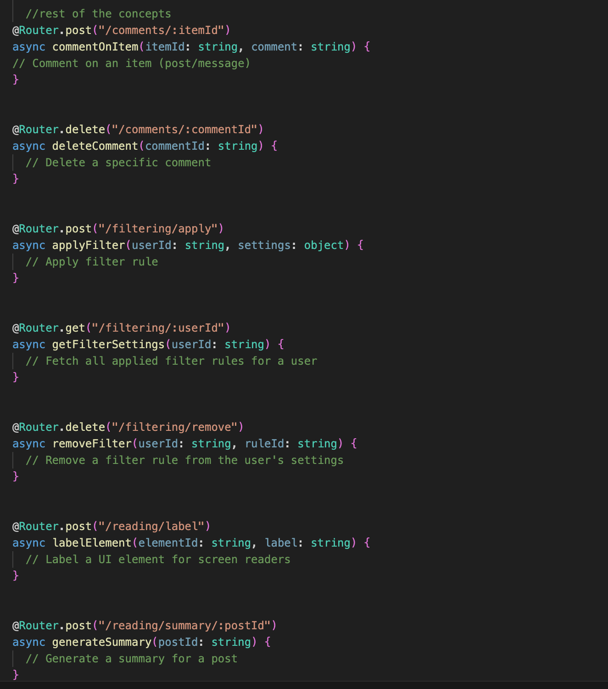

# Assignment 3- Backend (Alpha)

## Important Links
- Link to A4 Github repo- https://github.com/manasakudumu/noor-backend 

- Link to A3 (Convergent Design): https://manasakudumu.github.io/portfolio-mkudumu/assignments/assignment3.html 

- Link to Vercel Deployment: https://noorbackend-jyw42v4zs-manasa-kudumus-projects.vercel.app/

- 
## Abstract Data Models

## implementation for two concepts

## Initial outline of RESTful Routes

